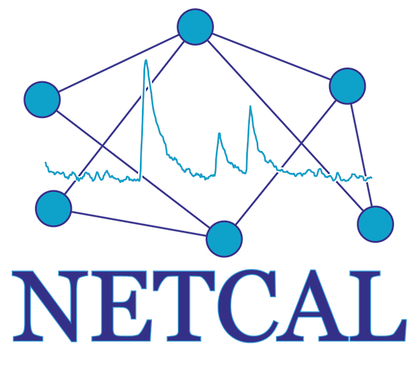

NETCAL: An interactive platform for large-scale, NETwork and population dynamics analysis of CALcium imaging recordings

NETCAL is a MATLAB-built, dedicated software platform to record, manage and analyze high-speed high-resolution calcium imaging experiments. Its ease of use, interactive graphical interface and exhaustive documentation is aimed to wet-lab researchers, but it will also meet the needs of any experienced data scientist through its plugin and scripting system. We have developed a large set of tools and incorporated state-of-the-art algorithms and toolboxes for large-scale analysis of network and population dynamics. Analyses include: automated cell detection (both static and dynamic); trace and population sorting through machine learning, clustering and pattern recognition; bursting dynamics; spike detection; network inference (from functional networks to causal relations); and many more. Several of these tools are also available in real-time, e.g. cells and spikes can be monitored during the actual recording, giving the researcher extensive feedback on the progress of the experiment.

# Installation instructions
- You can find [here](http://www.itsnetcal.com/getting-started/) the latest installation instructions.
- Install additional MATLAB toolboxes: Go to the installDependencies folder and execute the mltbx files (or drag and drop in MATLAB). NOTE: In MATLAB r2017a+ you might need to download the GUI Layout Toolbox from the Add On Explorer yourself.
- Change default MAT-Files version: Go to MATLAB Preferences -> General -> MAT-Files to v7.3
- To be able to export figures to pdf and eps you need ghostscript installed.
- To be able to use any of the python modules you need python installed and available to MATLAB

# Requeriments
- Matlab 9.1+ (2015a or higher) - 2017a or higher recommended

## MATLAB Tolboxes
- Bioinformatics Toolbox (4.5.1) [bioinfo]
- Curve Fitting Toolbox (3.5.1) [curve fit]
- Econometrics Toolbox (3.2) [econ]
- Global Optimization Toolbox (3.3.1) [globaloptim]
- System Identification Toolbox (9.2) [ident]
- Image Processing Toolbox (9.2) [images]
- Neural Network Toolbox (8.3) [nnet]
- Statistics and Machine Learning Toolbox (10.0) [stats]
- Computer Vision System Toolbox (6.2) [vision]

# Change Log

## [7.1.7] - 2018-01-24

### Modified
- Changed ROI factor name for event in statistics plots
- Changed amplitude for number of spikes (and a normalized option) for spike-based burst statistics

### Fixed
- Bug when loading/saving pipelines was not working if they contained deep structures with table-like lists

## [7.1.6] - 2018-01-23

### Added
- Spike detector based on ISI_N distributions (see [https://doi.org/10.3389/fncom.2013.00193](https://doi.org/10.3389/fncom.2013.00193))

### Modified
- Previous spike burst detector is now called rate detector. Also added option to plot (or not) its results

## [7.1.5] - 2018-01-23

### Added
- Peeling spike inference now has several new options to allow more customization (as in the original paper)
- Cartesian coordiantes export of ROI centers
- Export ROI coordinates button to the view ROI GUI

### Modified
- ROI centers export on the pipeline now has its own section (ROI)
- Spike inference modes are now in the same order as in the training window

## [7.1.4] - 2018-01-22

### Modified
- Moved Trace Fixer to the end of the View menu to avoid user missclicks

## [7.1.3] - 2018-01-22

### Fixed
- Spike inference: Schmitt trigger should correctly display detected events and thresholds in the training window

## [7.1.2] - 2018-01-22

### Added
- exportROIcenters: pipeline function to export ROI centers of a given group (groups: exports)

## [7.1.1] - 2018-01-22

### Added
- viewROI now accepts power spectrum images
- peak detector to detect peaks in traces (will be used to refine pattern-based classifiers)
- module to detect dying cells (those with step-like changes in fluorescence levels)
- view traces available in batch mode
- Several new features on the KCl analyis module
- Spike-based burst detection method
- Power-spectrum based preprocessing (obtain different average images based on power-spectrum bands)
- More spike features (spikes in bursts)
- More options for MLspike inference
- Cross-correlation measures
- New raster plots with average activity on top
- Options to multiply or divide all frames using an external file (to correct uneven light fields)

### Modified
- Updated CaImAn repository
- Updated CellSort repository and fully integrated it within NETCAL (GUI pending)
- Schmitt trigger now admits point to point thresholds
- Substantial speed up on automatic ROI detection (quick_dev and split modules)

### Fixed
- Renamed brick montage to avoid conflicts
- Some files where not being copied when importing/cloning exsting .EXP files
- Some statistics were not being correctly exported

### Removed
- Several consistency checks on trace fixer

### Known Bugs
- There is an ongoing bug where several pipeline functions are not being correctly loaded from their json files

## [7.0.0] - 2017-11-12

### Added
- Open beta release

### Known Bugs
- There is an ongoing bug where several pipeline functions are not being correctly loaded from their json files

## [6.3.0] - 2017-11-03

### Modified
- Clean slate preparing for OpenBeta release

## [6.2.1] - 2017-11-02

### Added
- Introduced Development mode to distinguish between dev builds and the open beta
- Preparing repository for open beta release

### Modified
- Increased menus responsiveness when switching between experiments
- Added error handling for incomplete video files

### Other
- Moved several functions into the new development folders (will only be avilable on the private/testing repository)

### Removed
- Links to old trunk versions in the repository

## [6.1.2] - 2017-10-30

### Added
- Option to define the type of averages when computing the statistics (mean or median)

## [6.1.1] - 2017-10-29

### Added
- Option to change bar group order in statistics plots (both normal and treatments)

### Fixed
- Cell-array-type options can now (hopefully) be correctly saved and loaded from pipeline files

## [6.1.0] - 2017-10-29

### Modified
- Complete rework of the optionsWindow GUI (again)

### Fixed
- Issue when data tables inside options were not being correctly saved

### Fixed
- Small bug fixes

## [6.0.13] - 2017-10-25

### Added
- Option to remove a background image on every frame-acquisition operation
- Metadata is now displayed on the experiment info tab
- External files to load patch clamp data
- External files to correctly read xml for future graphpad output

### Fixes
- Some bug fixes on the plot statistics options

## [6.0.12] - 2017-10-24

### Added
- Treatment  statistics for bursts

## [6.0.11] - 2017-10-24

### Added
- Treatment statistics now fully working for both population and spike statistics

## [6.0.10] - 2017-10-24

### Added
- Complete treatment statistics class. Implemented population statistics as first test

### Bugs
- Currenlty the set of labels inside the projectPipleine are not saved when moving through the options

## [6.0.9] - 2017-10-24

### Added
- Many pipeline statistics plots merged and integrated into a cohesive structure. Currently working: populations statistics, fluorescence bursts, spike statistics, permutation entropy/complexity
- Detailed warning incase the pipeline cannot be saved
- optionsWindow substructures working much better

### Modified
- boxPlot to accept multiple colors

## [6.0.8] - 2017-10-23

### Added
- DEBUG tag for pipeline functions. These functions won't be uplodaded to the production version but will appear on the pipeline
- Unified grid-like ROI addition. With option to reset or append new GRIDs

### Modified
- Pipeline functions now are sorted by name and children.
- baseOptions class now accepts structures
- optionsWindow help class generation accepts structures

### Fixed
- camControl new experiments were not being updated on the projectTree
- producedFields was missing on spikeDetectConflicts

## [6.0.7] - 2017-10-20

### Fixed
- Bug when the ROI screen could not be opened

## [6.0.6] - 2017-10-19

### Added
- Tononi complexity measure

## [6.0.5] - 2017-10-19

### Added
- Drag and drop a project onto the experiment list to load it
- Option to append a ROI file to a preexisting ROI list on the viewROI menu

### Fixed
- Issues with acute protocols and PCA analysis

## [6.0.4] - 2017-10-18

### Added
- Full rework on how to plot 1D statistics using a new class

### Modified
- viewRecording and viewROI menus now have a minimum width and height to deal with very one-dimensional recordings
- Redefined several observables for the acute protocols
- Number of (total/selected) ROIs now appear in the viewROI and viewTraces window

### Fixed
- Experiment info window was not always being updated after changes
- Sometimes new movies could not be generated from the viewRecording menu

## [6.0.3] - 2017-10-17

### Added
- Spike statistics for inter-experiment treatments (icomplete)
- Spike statistics now allows grouping by any kind of labels
- complexity-entropy curves with global spike trains
- Dissimilarity and complexity measures on the spike featurse (trivial implementation, not really useful as of now)

## [6.0.2] - 2017-10-16

### Added
- Several features to the acute stimulation protocols
- PCA Analysis with features from stimulation protocols

## [6.0.1] - 2017-10-16

### Fixed
- Some .avi files were not correctly being displayed on the viewRecording window

## [6.0.0] - 2017-10-15

### Added
- Entropy, ISI fano factor and ISI coefficient of variation as new spike features
- Analysis and statistics for acute stimulation protocols related to fluorescence transients (KCl for now)
- New experiment list tree (now with drag and drop functionality)
- MLspike now has options
- Experiments can have multiple (comma separated) labels. Also option to modify or add labels on the experiment list
- Options menu to change default/global options on a project
- Current pipeline functions can be copied by pressing control while dragging the function

### Modified
- Experiment and project pipelines fused into one
- Changelog only displayed on succesful updates in a new window
- Trees should have a consistent look now
- Project menu is now called File
- Switching between experiment mode and pipeline is now much faster

### Removed
- xlwrite support - it was a pain and was buggy for large exports. Use CSV instead

### Fixed
- Bug when moving functions/experiments on very large trees
- Lots of small fixes

### TODO
- Graphad export support
- Complexity measures

## [5.3.14] - 2017-10-10

### Fixed
- Removed debug lines on plotSpikeFeatures

## [5.3.13] - 2017-10-10

### Added
- traceFixer now also works on smooth traces, new correction method works much better on single traces.
- Procedures for the analysis of acute stimulation protocols

## Fixed

## [5.3.11] - 2017-10-03

### Fixed
- Lots of small bugs
- traceFixer should also work with smoothed traces now

## [5.3.10] - 2017-09-29

### Fixed
- Another issue when loading BTF files

## [5.3.9] - 2017-09-29

### Fixed
- Updated OASIS to the latest remote commit. New models available

## [5.3.8] - 2017-09-28

### Fixed
- Issue when opening the stream on BTF files

## [5.3.7] - 2017-09-28

### Added
- Support for BTF files

## [5.3.6] - 2017-09-28

### Added
- Manual option for the new trace fixer
- Trace fixer options are now also stored

## [5.3.5] - 2017-09-26

### Added
- OASIS integration
- pipeline: plotPopulationStatistics
- Lots of undocumented changes (sorry!)

## [5.3.2] - 2017-08-16

### Added
- New option to remove conflictive spike (those that pattern matching detected as something else)
- Valid patterns are now stored in a separate file to speed-up loading times

## [5.3.1] - 2017-07-12

### Fixed
- New try/catch mechanism for log messages

## [5.3.0] - 2017-07-09

### Added
- Pipelines: Run & Check buttons below the pipelines current function list
- Pipelines: Right click on any function in the available functions list to display its help
- Pipelines: project info is now also displayed on the pipeline modes
- Plot spike statistics function on the pipeline
- Added new options to the pattern count classification

### Fixed
- Small bug fixes

## [5.2.1] - 2017-07-05

### Added
- Relative threshold for foopsi spike infernece (works much better)
- Option to delete all patterns before a new import
- New options class for raster plots

### Fixed
- Lots of small bug fixes

## [5.2.0] - 2017-07-04

### Added
- Pipeline functions now support any number of parents and nested parents. Use colons to separate nested groups in the file header
- Pipeline functions for pattern-based group classification
- Pipeline functions for HCG detection
- Automatic detection and correction of corrupted HIS files
- Several new options to plot and export qCEC curves

### Modified
- Reestructured pipeline functions

## [5.0.4] - 2017-06-27

### Added
- Pipeline functions for burst detection
- Pipeline functions to load external pattern file
- View traces: when simultaneously viewing movie and traces, ROIs can be sorted by distance from a given point (by right clicking)
- camControl:  same roi sorting functionality as in view traces
- camControl: better webcam support
- Font sizes can be changed from the main preferences menu (experimental)

### Modified
- Completely redesigned burst analysis menu to fully implement pattern-based burst detection

### Fixed
- Several bug fixes

## [5.0.3] - 2017-06-21

### Fixed
- Several bugs on the view traces menu due to the new fast loading of the traces

## [5.0.2] - 2017-06-20

### Added
- Youtube channel! Subscribe to stay up to date [https://www.youtube.com/channel/UCQ8j9oytnMe34Ros_xV4x-w](https://www.youtube.com/channel/UCQ8j9oytnMe34Ros_xV4x-w)
- View traces: now when creating the HCG, two new groups will appear (one excluding the largest HCG and another excluding all HCG members)
- Improved burst statistics export
- Improved traces export

### Fixed
- Many small bug fixes

## [5.0.0] - 2017-06-19

### Added
- Denoiser to clean and generate new recordings
- Denoised movies are compatible with most primary functions, i.e., roi selection, trace extraction, smoothing...
- Speedup most functions by only loading the required traces and big fields at any given time
- Data cursors can now be enabled on many windows
- Percentile-based preprocessing
- viewTraces: option to sort ROIs by distance from pointer when visualizing movie and traces simultaneously

### Modified
- New smoothing option (v2), simplified and more accurate (in theory)

### Fixed
- Serval bug fixes

## [4.1.6] - 2017-06-13

### Added
- Compatibility for RIKEN VDAQ files
- Updater now skips user modified files that contain % MODIFIED in the header

## [4.1.2] - 2017-06-08

### Added
- View traces: ROI index now appears on the view positions menu
- qCEC: Option to show aggregated results by label

### Fixed
- Small bug fixes

## [4.1.0] - 2017-06-07

### Added
- Trace/event/manual training: You can select multiple training elements by pressing shift
- View Traces: You can move through the traces both with the arrowkeys and WASD. You can also move through training groups by pressing the appropiate number key
- View Traces: You should be able to move through the traces with the mousewheel

### Fixed
- Several bug fixes

## [4.0.10] - 2017-06-07

### Added
- Patterns: Impot/export feature
- Highly correlated groups: automatic search of optimal threshold

### Fixed
- Several bug fixes

## [4.0.9] - 2017-06-07

### Fixed
- Bug when saving the times after cuting the traces
- Added option to rebase time

## [4.0.8] - 2017-06-07

### Added
- Completed q-CEC pipeline functions. Added option to work on the raw traces instead

### Fixed
- More bug fixes

## [4.0.7] - 2017-06-06

### Fixed
- Weird bug on burstAnalysis

## [4.0.6] - 2017-06-06

### Fixed
- Error on PCA k-means

## [4.0.5] - 2017-06-05

### Added
- Automatic event classification
- q-complexity-entropy measure and sorting option
- Added pattern-based burst detection

## [4.0.4] - 2017-06-04

### Added
- Option to color the PCA results by experiment, label or cluster index
- Added subset option to export spikes
- Added option to plot raster in the pipeline
- Speedup of experiment saves

### Fixed
- loadExperiment with old quick_dev formats
- Loading experiment where the traces file could not be located anymore
- Several bugs with the new progressbar

## [4.0.3] - 2017-06-03

### Fixed
- Several bugs with the new progressbar

## [4.0.2] - 2017-06-01

### Added
- New robust smooth traces option

## [4.0.0] - 2017-05-28

### Added
- Completely redesigned progressbar, now it doesn't get stuck anymore while performing disk writes. There still might be compatibility issues with the old one. Hence the change in version major.
- Completely redesigned event-based trace classification - almost production-ready
- New default 'ask' option for updates
- Started integration of mlspike
- Black colormap

### Modified
- Considerable speedup on experiment saves - now traces and big folders are only saved if they are modified

### Fixed
- Lots of small bug fixes

## [3.3.14] - 2017-05-10

### Added
- camControl .bin files are fully supported

### Fixed
- Improved trace export feature

## [3.3.13] - 2017-05-09

### Added
- New button to load ROI for compatibility issues

## [3.3.12] - 2017-05-09

### Fixed
- Reverted the use of isstring due to compatibility uses with prior matlab versions

## [3.3.11] - 2017-05-08

### Added
- Experiments are now backed up after every save and one hour apart, so previous versions can be recovered
- Full export of burst statistics populations

### Fixed
- camControl now can handle importing all previous ROI files
- Issue with the trace smoothing where the spline could overshoot at the end of the recordings

### Removed
- Removing xls support on several export optionsk, since csv works much better and can directly be imported into excel

## [3.3.10] - 2017-05-08

### Added
- Export spikes pipeline

### Fixed
- Issue where the pipeline was being incorrectly saved (or not saved at all)
- Improved pbar reliability
- Improved trace loader

## [3.3.9] - 2017-05-04

### Added
- Pipeline option to export burst features

## [3.3.8] - 2017-05-03

### Added
- Zoom level is now preserved when browsing through traces
- Added alpha-channel slider when viewing the positions of the current traces
- Dual monitor setups are better supported when it comes to window positioning
- Option to clear the current log
- Option to import experiment from the workspace

### Fixed
- Several camControl issues when loading and saving ROIs

## [3.3.7] - 2017-05-01

- Missing

## [3.3.6] - 2017-04-24

### Added
- Pipeline option to export fluroescence traces features

### Fixed
- Small bugs on camControl

## [3.3.5] - 2017-04-24

### Added
- Plugin to import experiment from workspace 

## [3.3.4] - 2017-04-24

### Fixed
- small bugs on camControl

## [3.3.3] - 2017-04-24

### Fixed
- small bugs on camControl

## [3.3.2] - 2017-04-21

### Added
- Java-based multithreading for file writing

### Fixed
- Comptability issues with new newline function
- Spurious java warnings

## [3.3.1] - 2017-04-21

### Added
- Started the detailed documentation for every function
- macvideo support on camControl

### Fixed 
- Old glia analysis now conforms to the new call system

## [3.3.0] - 2017-04-19

### Added
- Options to deal with incomplete .HIS files
- Full integration of new generation camControl files
- Option to add and edit information in the experiments (metadata)
- viewTraces now conserves zoom while changing modes
- new automatic ROI detection mode (combines the previous two)
- Ability to generate .bin files with a raid-like structure
- Several new pipeline functions
- camControl now supports any winvideo-based camera
- Direct option to integrate experiments within MATLAB workspace

### Fixed
- Several bugs with json files in windows systems
- Disabled zero-padding on fft smoothing
- Lots of small bug fixes
- camControl is now a lot more robust

## [3.2.12] - 2017-04-10

### Added
- Option to resize all ROI
- Full integration of camControl within netCal. Now recorded videos will directly appear onto the current project

### Modified
- Moved several buttons from viewROI to the menubar

### Fixed
- Several errors when trying to load incomplete experiment files

## [3.2.11] - 2017-04-05

### Added
- camControl can now record experiments movies and traces simultaneouslly. Almost ready for production 

## [3.2.10] - 2017-04-03

### Added
- Several functions to camControl

### Fixed
- New issue when loading old exported ROI files

## [3.2.9] - 2017-03-30

### Fixed
- Issue with overlapping paths due to oasis dependencies

## [3.2.8] - 2017-03-30

### Added
- The viewRecording plugin now remembers the last used folder
- Oasis spike inference (only in training for now)
- Barebones cam control (camControlRedux) 

### Fixed
- Bug with some HIS files where the last frames would appear out of place

## [3.2.7] - 2017-03-17

### Added
- Option to reset ROI IDs
- Ability to compare experiments with different number of ROIs (will only compare equal IDs)

### Fixed
- Bug when exporting ROI lists that were moved around

## [3.2.6] - 2017-03-16

### Added
- Pipeline modes for plotting and exporting spectrograms
- Ability to preload experiment options in the pipeline functions

## [3.2.5] - 2017-03-15

### Added
- Spectrogram to the viewTraces menu
- Analysis of avalanches exponents
- Automatic ROI deletion when moving all ROIs simultaneously

### Fixed
- Removed hardcoded robuboost trainer when only 2 populations existed
- Changed from pcolor to imagesc on fluorescence rasters for 1:1 representation

## [3.2.4] - 2017-03-09

### Added
- Several avalanche analysis functions 

### Fixed
- Drift of spike times when the frame rate was fractional
- Baseline in oopsi

## [3.2.3] - 2017-02-28

### Fixed
- Several fixes to the new pbar structure

## [3.2.3] - 2017-02-22

### Added
- New options on experiment comparison

## [3.2.2] - 2017-02-22

### Added
- New option for batch experiment comparison

### Fixed
- Several bugs fixes

## [3.2.1] - 2017-02-21

### Fixed
- Several bugs with the new pbar

## [3.2.0] - 2017-02-16

### Added
- Redesigned progressbar and its calls standarizing implementation
- Several new pipeline functions
- Parallel (asynchronous) running of the pipeline (1 experiment per thread)
- Experiment-specific validation of function options initial values 
- Transition plots now have trasnparency and count type options
- Transition plots now have a minimum bar size to avoid issues with nearly empty populations

### Fixed
- Several bugfixes

## [3.1.7] - 2017-02-13

### Added
- More options for automatic import of multiple experiments
- Option to directly import CRCNS datastes (MEA)
- More pipeline functions

### Modified
- Faster load of multiple experiments

### Fixed
- Memory leak on spike feature extraction for very large spike trains
- Bug when displaying spikes form non-fluorescence experiments

## [3.1.6] - 2017-02-13

### Added
- Much better handling of the options window in pipeline mode

## [3.1.5] - 2017-02-12

### Added
- Second pipeline mode for directly managing projects.
- Experiment pipeline is for functions that run on experiments individually.
- Project pipeline is for functions that run on all the checked experiments at once.

## [3.1.4] - 2017-02-12

### Added
- Several functions to the pipeline

## [3.1.3] - 2017-02-12

### Added
- Automatic sorting of the function list based on their dependencies

## [3.1.2] - 2017-02-11

### Fixed
- Bug with the update preventing creation of new folders 

## [3.1.1] - 2017-02-11

### Added
- Color coding for progress in pipeline mode

### Added

## [3.1.0] - 2017-02-11

### Added
- Pipeline mode fully working. But most functions still need to be passed to the new format
- Several standalone functions for the new pipeline mode

### Fixed
- Typo on refineROI mode

## [3.0.31] - 2017-02-08

### Added
- Option on PCA analysis to import an old PCA basis

## [3.0.30] - 2017-02-07

### Added
- Option on PCA analysis to import an old PCA file

## [3.0.29] - 2017-02-07

### Fixed
- ROI with wrong colors on the ppt reports
- Improved the speed of grid-like ROI detection
- Added warnings on spike feature extraction

## [3.0.29] - 2017-02-07

### Fixed
- Several trace features were not working as intended

## [3.0.28] - 2017-02-07

### Added
- Unsupervised trace classifier based on fuzzy clustering
- Several new features for trace classification 
- More detailed error messages

### Fixed
- Error when a population was not defined in the aggregated statistics

## [3.0.27] - 2017-02-06

### Added
- SaraReport now allows statistics on glia events
- Much more detailed error repot messages

### Fixed
- Very specific bugs on spike selection

## [3.0.26] - 2017-02-06

### Added
- Spike/event features based on schmitt trigger inference
- Export options for both spikes and spikea features in the view spikes menu
- Option to remove the average (or percentile) trace from the recording 

### Fixed
- Bugs on the ppt report
- Bug on trace classifier when using other experiments
- Bug when importing multiple experiments with wrong extension capitalization

## [3.0.25] - 2017-02-05

### Fixed
- Bugs on the trace selection in the spikes window 

## [3.0.24] - 2017-02-05

### Fixed
- Bugs on the new options window
- Bugs on the trace selection

## [3.0.23] - 2017-02-05

### Added
- Enabled pipeline mode. Menus and function selection working. Still a lot to go. 

### Fixed
- Several bug fixes in trace and group selection
- Several bug fixed in ppt report

## [3.0.22] - 2017-02-04

### Fixed
- PPT report should be working again

## [3.0.21] - 2017-02-01

### Added
- Automatic fluorescence processing now works for both single and batch experiment modes
- Basis for the new pipeline mode

### Fixed
- Bug when loading smoothed traces that were already in numeric mode
- Several bugs on the trace selection and ordering process. Simplified the functions

## [3.0.20] - 2017-01-27

### Added
- Real time spike detection on camControl (via foopsi)
- Standalone version of viewRecording can be called via the plugins menu

### Modified
- Improvements on camControl

## [3.0.18] - 2017-01-26

### Modified
- Improvements on camControl

## [3.0.16] - 2017-01-25

### Modified
- Improvements on camControl

## [3.0.15] - 2017-01-25

### Modified
- auto levels now works much better. It is iterative and persistent

### Fixed
- Several bugs on view traces menu for subpopulations
- Spike features menu was not working
- Consistency check on windows systems was not working properly

## [3.0.14] - 2017-01-25

### Added
- camControl plugin to control Hamamatsu cameras 

## [3.0.13] - 2017-01-24

### Added
- viewRecording as a standalone function 

## [3.0.12] - 2017-01-24

### Fixed
- Issue with the udpater in windows

## [3.0.11] - 2017-01-24

### Added
- Foopsi model for spike inference fully working
- Automatic ROI detection as a new analysis menu (working towards pipeline model)

### Modified
- Swapped around the way the options for spike inference training work

## [3.0.10] - 2017-01-20

### Fixed
- Bug with the output of spike inference training
- Burst detection was not working with ill-defined groups
- The recording image was not displaying correctly after changing the file handle path

## [3.0.9] - 2017-01-19

### Fixed
- Bug when the update required changes in the progressbar

## [3.0.8] - 2017-01-19

### Added
- Menu to check consistency of the files and to force updates

## [3.0.7] - 2017-01-18

### Fixed
- Issues with the file by file updater

## [3.0.5] - 2017-01-17

### Added
- Completed view groups options by adding the group list on the left.
- Ability to delete, rename and sort groups from the view groups menu.

## [3.0.4] - 2017-01-17

### Fixed
- Bug when loading ROI

## [3.0.3] - 2017-01-17

### Fixed
- Bug when the Tree structure was not being loaded correctly from uiExtras package
- Bug when the updater was not creating the appropiate directories

## [3.0.2] - 2017-01-16

### Fixed
- Bug when the ROI list was an empty cell
- Bug when trying to execute PCA analysis with old groups in the experiments

## [3.0.1] - 2017-01-15

### Added
- Complete redesign of the way experiments are managed. Now there are two main working modes. Single experiment or batch mode. On single experiment you can proceed as usual, view and analyzing stuff one by one. On batch mode you just check the list of experiments that you want to analyze and each function will be performed on the checked list. Also the averaged statistics will only appear on the batch mode and apply to the checked experiments in the current order. The experiment order and labels can now be changed by right clicking on the experiment list.
- Complete redesign of the update function, now it updates file by file instead of downloading a single big zip every time.
- There is no concept of active experiment anymore. Experiments are loaded and saved on demand. Now if you have more than one view window open at any given time, experiments will not be saved on exit unless forced. Now there is an option to force save on each of the viewing windows.
- New view groups window to simply view the defined groups (populations) and do some statistics on them.
- Ability to export the groups generated by PCA and k-means analysis back to the original experiments.
- List of analysis, viewing and statistics functions are now created programatically with the loadModules() function, now it should be much faster to create new menus via plugins.
- Added beeswarm-like option to view distributions
- Several minor undocumented changes

### Modified
- Several old functions are now incomplete. Namely the automatic processing of multiple functions at the same time.
- notBoxPlot now shows each point with a beeswarm-like structure

## [2.4.2] - 2016-12-16

### Added 
- Splash screen
- Logo

### Fixed
- Bug on the progressbar for smoothing traces

## [2.4.1] - 2016-12-14

### Added
- Option to select export file format on preprocessing
- Option to export pca contributions
- Early check for GUI Layout toolbox

## [2.4.0] - 2016-12-13

### Added
- Improvmeents on glia analysis
- New window for spike inference training
- Option to display the spikes features distributions
- Redesigned progressbar - iterative, sequential and circular
- Nonmodal options window
- Options window help automatically generated
- Spikes are now visible on view recording and view glia windows

### Modified
- Better handling on the positioning of new figures and the first time they become visible
- Rework on automatic processing

### Fixed
- PCA contributions were being incorrectly displayed
- Missing java library declaration for xlsx exports

## [2.3.4] - 2016-12-1

### Added
- Improvements on glia analysis
- Option to compress (or not) export movies

### Fixed
- Bug when selecting populations for the peeling
- Bug when resetting training traces
- Bug with new preprocessing options

## [2.3.3] - 2016-11-29

### Added
- Statistics and plots for the glia events

## [2.3.2] - 2016-11-29

### Added
- Option to view the populations on the view recordings gui 

## [2.3.1] - 2016-11-28

### Fixed
- Update error if netcal.json was not present

## [2.3.0] - 2016-11-27

### Added
- Log panel on all GUI windows
- New projects are also added to the recent projects list
- Preparing menus for spike inference
- Option to train populations with learning traces from other experiments

### Modified
- Complete rework on the log messaging system
- Complete rework on how the gui handles are passed through windows
- Removed the tabbed structure from the main window, since I haven't found any use for it since the beginning.
- Name of main windows - for better understanding
- Positioning of new figures, so there is less overlap
- Recent projects menu now display as multiple lines if the path is too large

### Fixed
- Aggregated PCA windows
- Possible infinite loop when updating menus
- Recent project order is updated so the latest load always become the last one in the list
- Recent project list is read backwards, so the last one is the top one on the list

## [2.2.7] - 2016-11-26

### Added
- Option for loading recent experiments
- Option for batch burst analysis
- Option to plot tangent transitions in the experiment comparisons plots

### Modified
- Completed burst viewing on view recording

### Fixed
- Several

## [2.2.6] - 2016-11-25

### Added
- Several new avg trace options in the preprocess menu

### Modified
- Complete rework on the import/export groups menu - now based on trees

## [2.2.5] - 2016-11-24

### Added
- Major work on glia analysis
- Key bindings for view recording

## [2.2.4] - 2016-11-24

### Fixed
- Bug when plotting experiment comparisons

## [2.2.3] - 2016-11-24

### Fixed
- Bug when comparing experiments

## [2.2.2] - 2016-11-23

### Fixed
- Bug when preprocessing new experiment

## [2.2.1] - 2016-11-23

### Modified
- Fixed group imports and exports 

## [2.2.0] - 2016-11-23

### Added
- Check for invalid zip files
- Additional external functions
- Added plots to compare population flows between experiments
- Option to extract traces with a median filter
- Added fft trace baseline correction
- Options for real size and image reset on viewROI menu
- Added help menu on the options window

### Modified
- Complete rework on all GUIs to allow arbitrary groups.
- Complete rework on the experiment comparison
- Complete rework on the multi-experiment statistics
- Complete rework on the experiment and populations selection procedures

### Fixed
- Lots

## [2.1.9] - 2016-11-17

### Modified
- Merged ROI preferences options into a class
- Merged automatic ROI procedures into one

## [2.1.8] - 2016-11-16

### Added
- New popup window for experiment selection when there are too many experiments (>25)
- Options class for peeling
- Batch peeling procedure

### Modified
- Redesigned the experiment lists menus
- Redesigned the peeling functions
- Option to show spikes and burst length in view traces menu, now each burst in its own color
- Several spike features

### Fixed
- Burst length based on fluorescence analysis now is a lot more accurate
- New spike features were not being saved properly

## [2.1.7] - 2016-11-16

- Skipped

## [2.1.6] - 2016-11-15

### Added
- FCA menu
- View traces: menu to show the baseline (if saved)
- Option to sort traces by FCA order

### Modified
- View traces: for the smooth traces, the dashed line now shows where the 0 fluorescence level should be 
- View traces: redesigned the alignTraces option
- Added several new options for trace smoothing

## [2.1.5] - 2016-11-14

### Added
- Option to see the new fluorescence-based spike burst size on the traces menu

### Modified
- The spike features are now obtained from the spike inference menu (not inside view spikes)

## [2.1.4] - 2016-11-11

### Fixed
- Automatic updater was not working

## [2.1.3] - 2016-11-11

### Fixed
- Bug while importing quick_dev mat files from dcimg recordings
- Gui display on glia functions

## [2.1.2] - 2016-11-9

### Added
- Button in the options window to revert any changes to the default values

## [2.1.1] - 2016-11-9

### Fixed
- Several bugs with handling the new options classes
- Bugs in the preprocessing window

### Modified
- Completeley redesigned the smoothing  menu

## [2.1.0] - 2016-11-7

### Added
- Compliance with semantic versioning - had to update to directly to 2.1.0 for compatibility issues

### Fixed
- Bug when importing HIS files with unstandard datatypes 
- Bug when comparing experiments

## [2.0] - 2016-11-7

### Added
- Help section, including acknowledgments and the changelog.
- Started the coding guidelines (see GUIIDELINES.md)
- Enabled the use of Markdown. This should speed up creating help sections and posterior documentation
- Several undocumented changes (check commits)

### Modified
- Completey redesigned the options class and the optionsWindow menu. Not it has a lot more functionality
- Reestructured several menus
- Base netcal options are stored in an external json file, not a matlab object

### Fixed
- Progressbar can safely be closed (even if was already closed)

### Deleted
- Bunch of unused external dependencies

## [1.109] - 2016-11-3

### Fixed
- Bug selecting points in the PCA plot.

### Modified
- Work around to export features on the PCA analysis as separate bugs. There is a memory bug when creating too large xls files in there 

## [1.108] - 2016-11-3

### Fixed
- Bug when exporting aggreted experiments from the PCA analysis - due to the new trace structure

## [1.107] - 2016-11-2

### Added
- Traces of individual cells can be selected on the View Recording menu by right clicking on top of the cell
- Spikes and bursts from the HCG can be seen on the View Recording menu from its menu
- Option to export a movie (and figure) with the current View Recording options

### Modified
- Export option on the glia menu to match those on the view recording 

### Fixed
- Bugs on some progress bars when the number of total iterations was below 100

## [1.106] - 2016-11-2

### Added
- Option to do K-Means analysis of spike data with NaN values
### Fixed
- The znorm option in K-Means was not really doing a z-norm (only rescaling)

## [1.105] - 2016-11-2

### Added
- New options to select specific features from the spikes
- New feature using the fluorescence trace to define burst length

### Modified
- Generalized the feature list on several plots

### Fixed
- Current experiment was not being saved before doing batch PCA analysis

## [1.104] - 2016-11-2

### Added
- Option to reset all training on the view traces menu

### Fixed
- Bug when selecting traces to train (caused by the new colormap)s

## [1.103] - 2016-10-31

### Added
- Colormap selection on all menus now also show the colorbar

### Changed
- Program now shows release notes of the latest 3 versions

## [1.102] - 2016-10-31

### Added
- Spike features options are now passed like any other options
- Added temporal range to the spike features extraction

## [1.101] - 2016-10-31

### Changed
- Current experiment is no longer stored inside the current project
- Consistency check on finish ROI selection to delete old traces
- Cleanup of project files

### Fixed
- Fixed a bug when cloning current experiment
- Fixed a bug in the aggregated density menu

## [1.100] - 2016-10-31

### Added
- Options are now saved both inside the experiment and the project files (not only for the project)
- Created base class for options windows
- Batch smoothing options
- Added K-means options on view PCA
- Added PCA export by features

### Changed
- Progressbar support for multiple bars and color changes with completion, not randomly
- Changed all options classes to adhere to the new base class
- Merged analysis menus together
- Redesigned the batch process system

### Removed
- Classifier class is no longer stored in the experiment

### Fixed
- Bug when cancelling export to xls
- No need to Add Gui handles when loading options classes

## [1.99] - 2016-10-29
Undocumented. Check commits

[7.1.7]: https://github.com/orlandi/netcal/tree/v7.1.7
[7.1.6]: https://github.com/orlandi/netcal/tree/v7.1.6
[7.1.5]: https://github.com/orlandi/netcal/tree/v7.1.5
[7.1.4]: https://github.com/orlandi/netcal/tree/v7.1.4
[7.1.3]: https://github.com/orlandi/netcal/tree/v7.1.3
[7.1.2]: https://github.com/orlandi/netcal/tree/v7.1.2
[7.1.1]: https://github.com/orlandi/netcal/tree/v7.1.1
[7.0.0]: https://github.com/orlandi/netcal/tree/v7.0.0
