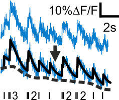

# MLspike

_MLspike_ is an algorithm to reconstruct neuronal spiking activity from noisy calcium recordings. Its description and benchmarking can be found in [(Deneux et al. 2016)](http://www.nature.com/articles/ncomms12190).

### Documentation

Main functions are:

    tps_mlspikes         estimate spikes from calcium (note the function spk_est, which is a small wrapper of tps_mlspikes)
    spk_autocalibration  auto-calibration of parameters A, tau, sigma
    spk_autosigma        auto-calibration of parameter sigma
    spk_gentrain         generate simulated spike train
    spk_calcium          generate simulated calcium signal
    spk_display          display spikes and calcium signals together
    spk_calibration      calibration, i.e. estimate the values of physiological parameters based on true spikes and recorded calcium signals

Simulation and estimation run with parameters, default parameters are easily obtained, for example, `par = tps_mlspikes('par');`.
 
Help for each function can be provided by typing `help function_name`.
Additional help can be found in the Help browser: type `doc`, then go to 'Supplemental Software' > 'MLspike toolbox'
 
### Demo

Two demos exist:

**`spk_demoGUI`**   This script runs MLspike (but not the autocalibration) on 
               simulated data, with a graphic interface that lets user play with
               the simulation and estimation parameters.
               It provides an immediate understanding of MLspike abilities, and 
               of how does estimation accuracy depend on the characteristics of
               the data and on estimation parameters.
               
**`spk_demo`**   this script generates simulated data and runs successively the
            MLspike and autocalibration algorithms on it; use it to learn how to
            use the different functions; comments in the code indicate how to 
            replace the simulated data by your own data
            Matlab-published output of this script can be seen in the 'help' folder.

A more complex script can be studied as well to better understand the algorithms:

**`spk_factorbox`** this script generates the factor box that is part of the manuscript supplementary material. Matlab-published output of this script can be seen in the 'help' folder.

           
